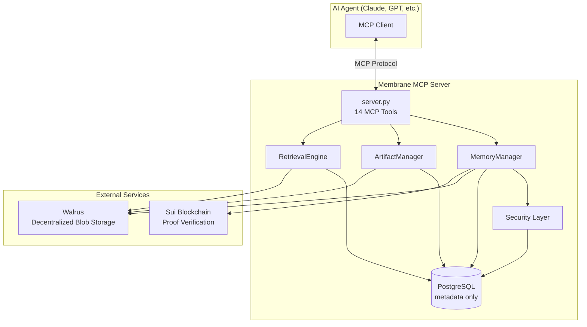

# <p align="center">Membrane</p>

<p align="center">


### Universal, Persistent & Verifiable Memory Infrastructure for AI Agents

### **The Memory Layer for the Agent Ecosystem**

Built for **Sui Overflow 2026**

</p>


<p align="center">



</p>


# Problem

AI agents today operate with fragmented and ephemeral memory systems.

Each framework implements memory differently.

| Framework      | Memory          |
| -------------- | --------------- |
| Claude Desktop | Session Context |
| OpenAI Agents  | Threads         |
| LangGraph      | Checkpointers   |
| CrewAI         | Internal State  |
| Custom Agents  | Reinvented      |

As a result:

* Agents forget information after conversations end
* Long-term context is difficult to maintain
* Cross-agent collaboration is fragmented
* Memory systems are repeatedly rebuilt
* Stored memories cannot be independently verified

Memory remains an application feature.

We believe memory should be infrastructure.


# Solution

Membrane is a decentralized memory layer exposed through the **Model Context Protocol (MCP).**

Any MCP-compatible agent can connect to Membrane and immediately gain:

✅ Persistent memory

✅ Semantic retrieval

✅ Artifact storage

✅ Encryption

✅ Cryptographic verification

✅ Shared memory spaces

✅ On-chain provenance

Instead of implementing memory independently, agents interact with a standardized memory service.

```text
Claude
   │
   ▼
Membrane
   ▲
   │
Cursor


LangGraph
   │
   ▼
Membrane
   ▲
   │
GPT
```

One Memory Layer.

Many Agents.

Zero Lock-In.


# Why Sui?

Membrane uses Sui because verifiable memory requires immutable proofs.

Each stored memory can optionally produce:

* SHA256 digest
* Timestamped proof
* Transaction record
* Provenance metadata

This enables:

* Tamper detection
* Auditable histories
* Trustless verification
* Memory provenance


# Why Walrus?

AI memories are fundamentally blob-oriented.

Examples:

* Conversations
* PDFs
* Images
* Logs
* Workflow checkpoints
* Agent outputs

Walrus provides:

* Decentralized storage
* Blob-native architecture
* Cost efficiency
* Scalability

Membrane stores heavy payloads entirely on Walrus.

PostgreSQL only indexes metadata.


# Architecture

Membrane separates storage into three independent layers.

## Walrus

Canonical memory storage

Stores:

* Memory payloads
* Documents
* Artifacts
* Agent state


## PostgreSQL

Fast metadata index

Stores:

* Tags
* Owners
* Namespaces
* Embeddings
* Blob pointers
* Visibility rules

No memory content is stored locally.


## Sui

Verification layer

Stores:

* Content hashes
* Transaction references
* Proof metadata

Enables cryptographic verification.


# Hybrid Retrieval Engine

Membrane combines two retrieval strategies.

### Metadata Filtering

Filter by:

* Namespace
* Owner
* Visibility
* Tags


### Semantic Search

Embedding Model

```python
all-MiniLM-L6-v2
```

Produces:

384-dimensional embeddings

Ranking:

Cosine Similarity


# Security

## Encryption

Optional Fernet encryption

AES-CBC

*

HMAC-SHA256


## Verification

Five-step integrity pipeline

1. Fetch blob

2. Decrypt content

3. Recompute SHA256

4. Verify HMAC

5. Verify Sui proof


# Features

### Persistent Agent Memory

Store memories beyond conversations.


### Semantic Recall

Hybrid search with embeddings.


### Artifact Storage

PDFs

Images

Logs

Workflows


### Memory Verification

Detect tampering cryptographically.


### Shared Agent Context

Namespaces enable multi-agent collaboration.


### Optional Encryption

Sensitive memories remain private.


# MCP Tools

Membrane exposes **14 MCP tools**.

### Memory

* store_memory
* search_memory
* update_memory
* delete_memory
* verify_memory


### Artifacts

* store_artifact
* get_artifact
* list_artifacts


### Inspection

* inspect_memory
* show_graph
* list_agents
* list_workflows
* verify_blob


# Demo

## Example

Agent:

```python
store_memory(
content="Meeting with team tomorrow",
tags=["calendar"]
)
```

Later:

```python
search_memory(
query="When is my team meeting?"
)
```

Result:

```text
Meeting with team tomorrow
```

Verified.

Persistent.

Searchable.


# Project Structure

```text
membrane/

├── server.py
├── memory_manager.py
├── artifact_manager.py
├── retrieval.py
├── security.py
├── walrus_client.py
├── sui_client.py
├── db.py
├── models.py
├── config.py
└── tests/
```


# Roadmap

### Completed

* MCP Server
* Walrus Integration
* Hybrid Search
* Encryption
* Artifact Storage
* Proof Verification

### In Progress

* Sponsored Transactions

* Hosted Multi-Tenant MCP Endpoints

* Memory Graph UI

### Future

* Agent Reputation

* Access Policies

* Memory Marketplace


# Vision

Models became APIs.

Payments became Stripe.

Storage became S3.

Identity became OAuth.

We believe memory should become infrastructure.

Membrane aims to become the universal memory layer powering the next generation of AI agents.


<p align="center">

## Memory should persist.

## Memory should be portable.

## Memory should be verifiable.

</p>
